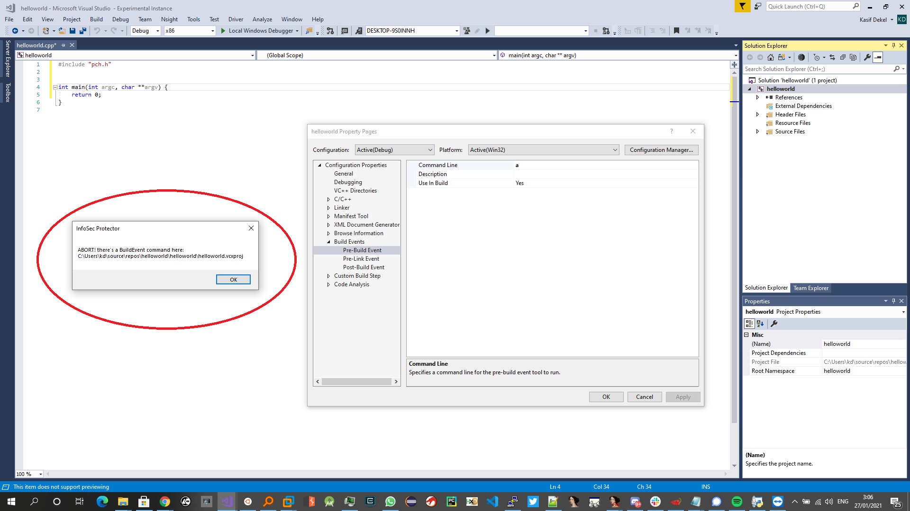

# ``infosecprotector`` - Protect the infosec from north korea

This was created as a joke after this was published: https://blog.google/threat-analysis-group/new-campaign-targeting-security-researchers/.

Although its fully working and can be used seriously.

No warranty tho.

